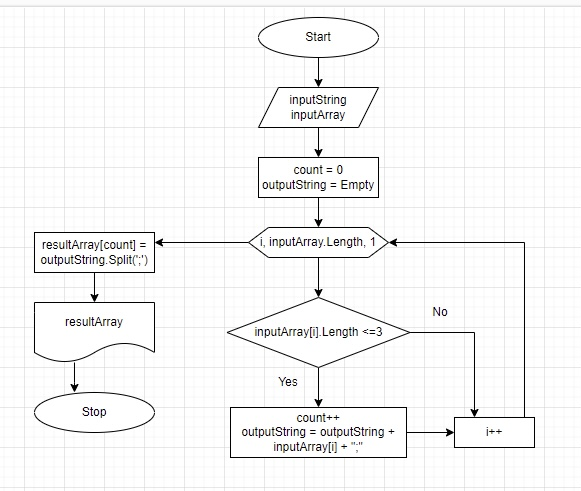

Пользователь заполняет стартовый массив элементами через пробел.
Далее проходим по стартовому массиву в цикле и проверяем, подходит ли элемент условию "длина символов <= 3". 
Если элемент подходит под данное условие, то мы добавляем строку через ";" и в отдельной переменной мы накапливаем количество элементов, попадающих под условие. Создаем новый массив, используя созданный нами дополнительный счетчик, чтобы элементы в новом массиве заполнялись последовательно. Выводим на печать.

